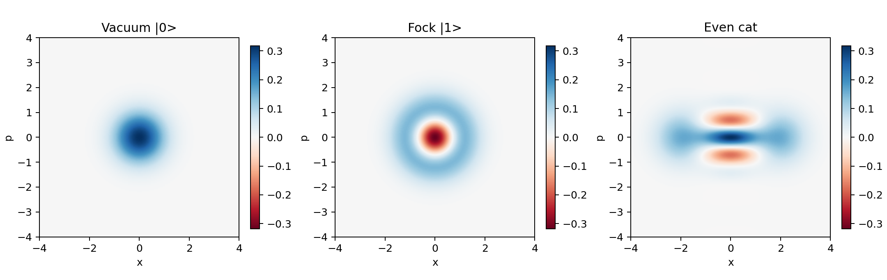

# qopy

`qopy` is a lightweight Python toolbox for quantum optics and continuous-variable quantum information.

It provides numerical tools for:

- phase-space objects (Wigner, Husimi, transforms, negativity, marginals),
- state-space objects (kets, density matrices, channels, entropy/energy/purity),
- Gaussian and non-Gaussian state manipulations,
- quick visualization utilities for 2D/3D phase-space plots.



## Why qopy

`qopy` is designed for fast research iteration:

- easy-to-call functions with NumPy arrays,
- broad coverage of common CV quantum optics workflows,
- compact codebase that is simple to inspect and extend.

## Installation

From source (recommended while the project is evolving):

```bash
pip install git+https://github.com/zac-vh/qopy.git
```

For local development:

```bash
git clone https://github.com/zac-vh/qopy.git
cd qopy
pip install -e .
```

## Quick Start

### 1) Build and visualize Wigner functions

```python
import qopy

rl, nr = 8.0, 201
w0 = qopy.phase_space.wigner.fock(0, rl=rl, nr=nr)
w1 = qopy.phase_space.wigner.fock(1, rl=rl, nr=nr)

qopy.plotting.plot_2d([w0, w1], rl=rl, titles=["|0>", "|1>"])
```

### 2) Build a state and compute physical quantities

```python
import qopy

N = 30
ket = qopy.state_space.ket.coherent(alpha=1.2 + 0.4j, N=N)
rho = qopy.state_space.density.from_ket(ket)

purity = qopy.state_space.measures.purity(rho)
energy = qopy.state_space.measures.energy(rho)

print(f"purity = {purity.real:.6f}")
print(f"energy = {energy:.6f}")
```

## Project Structure

- `qopy/phase_space/`: Wigner/Husimi builders, phase-space transforms, measures.
- `qopy/state_space/`: ket and density tools, channels, bosonic operators.
- `qopy/plotting.py`: plotting helpers for phase-space arrays.
- `examples/`: runnable scripts and research notebooks.
- `docs/`: short user-facing documentation.

## Documentation and Examples

- Quickstart guide: `docs/quickstart.md`
- Example index: `examples/README.md`
- Notebook examples:
  - `examples/cubic_phase_state_majorization.ipynb`
  - `examples/relative_majorization_chain_fock_states.ipynb`
  - `examples/superposition_displaced_squeezed_fock.ipynb`
  - `examples/incomparable_quantum_states.ipynb`
